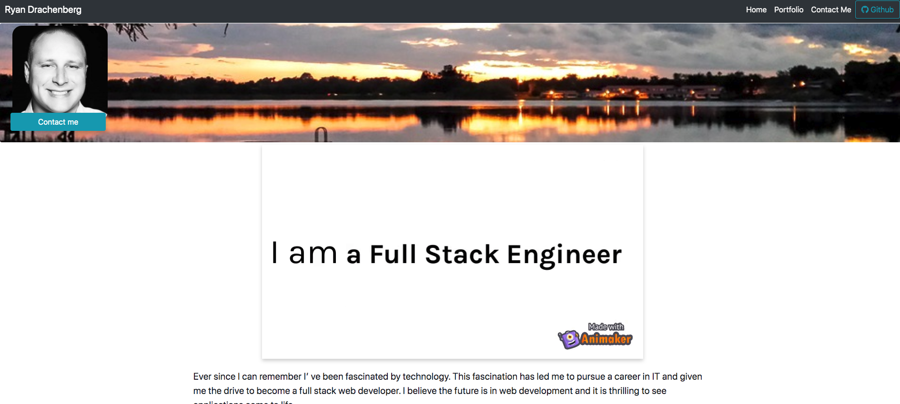
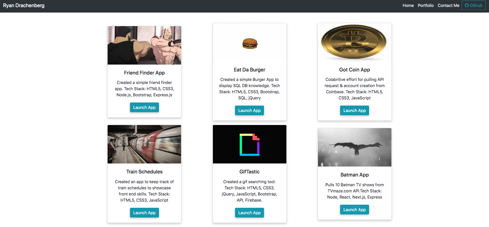
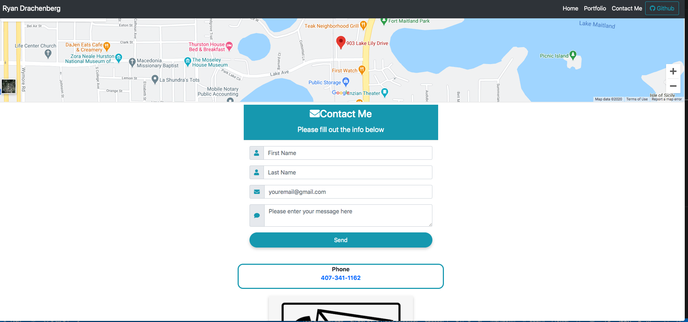

# Ryan's Portfolio App

#### A MERN (MongoDB, Express.js, React.js, Node.js) stack app to display my personal portfolio. [Heroku Deployed](https://ryan-react-app.herokuapp.com/) 

    
    
    
    
    
     
    
    
    

    
     
    

 

### Tech Stack - MERN

    MongoDB, Express.js, React.js, Node.js

### Home Page

### Portfolio

### Contact Me

### Root File Structure

    📦ryan-react-app
    ┣ 📂client
    ┣ 📂config
    ┃ ┣ 📜config.js
    ┃ ┣ 📜database.js
    ┃ ┣ 📜express.js
    ┃ ┗ 📜routes.js
    ┣ 📂controllers
    ┃ ┣ 📜index.js
    ┃ ┣ 📜message.js
    ┃ ┣ 📜post.js
    ┃ ┣ 📜project.js
    ┃ ┣ 📜user.js
    ┣ 📂models
    ┃ ┣ 📜Message.js
    ┃ ┣ 📜Post.js
    ┃ ┣ 📜Project.js
    ┃ ┣ 📜TokenBlacklist.js
    ┃ ┣ 📜User.js
    ┃ ┗ 📜index.js
    ┣ 📂routes
    ┃ ┣ 📜index.js
    ┃ ┣ 📜message.js
    ┃ ┣ 📜post.js
    ┃ ┣ 📜project.js
    ┃ ┗ 📜user.js
    ┣ 📂scripts
    ┃ ┣ 📜build.js
    ┃ ┗ 📜start-client.js
    ┣ 📂utils
    ┃ ┣ 📜auth.js
    ┃ ┣ 📜index.js
    ┃ ┗ 📜jwt.js
    ┣ 📜LICENSE
    ┣ 📜Procfile
    ┣ 📜README.md
    ┣ 📜package.json
    ┗ 📜server.js

### Client File Structure

    📦client
    ┣ 📂build
    ┃ ┣ 📂static
    ┃ ┃ ┣ 📂css
    ┃ ┃ ┣ 📂js
    ┃ ┃ ┗ 📂media
    ┣ 📂public
    ┣ 📂src
    ┃ ┣ 📂App
    ┃ ┣ 📂Components
    ┃ ┃ ┣ 📂Body
    ┃ ┃ ┣ 📂Contact
    ┃ ┃ ┣ 📂Footer
    ┃ ┃ ┣ 📂HomeContent
    ┃ ┃ ┣ 📂Login
    ┃ ┃ ┣ 📂MessageBoard
    ┃ ┃ ┣ 📂MostLanguages
    ┃ ┃ ┣ 📂NavBar
    ┃ ┃ ┗ 📂Portfolio
    ┃ ┣ 📂Main
    ┃ ┣ 📂services
    ┃ ┣ 📜index.css
    ┃ ┣ 📜index.js
    ┣ 📜package.json
    ┣ 📜static.json